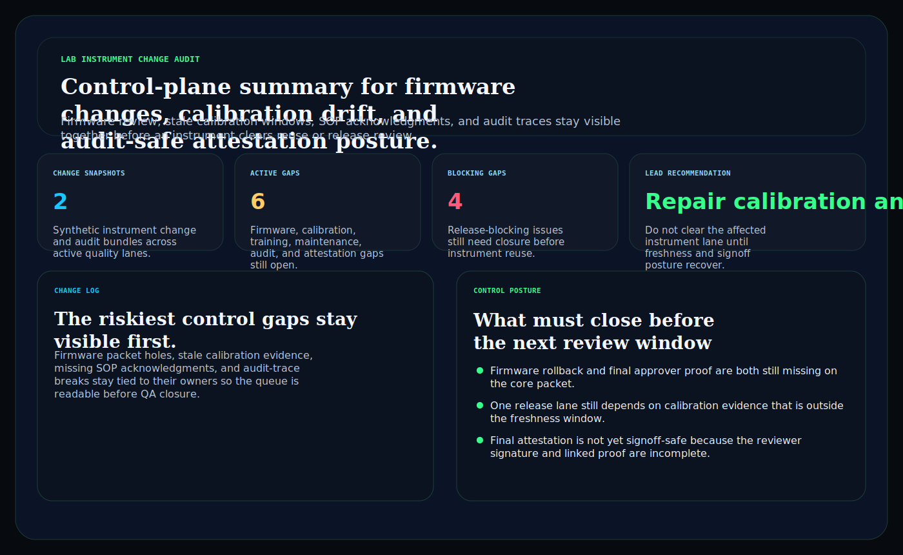
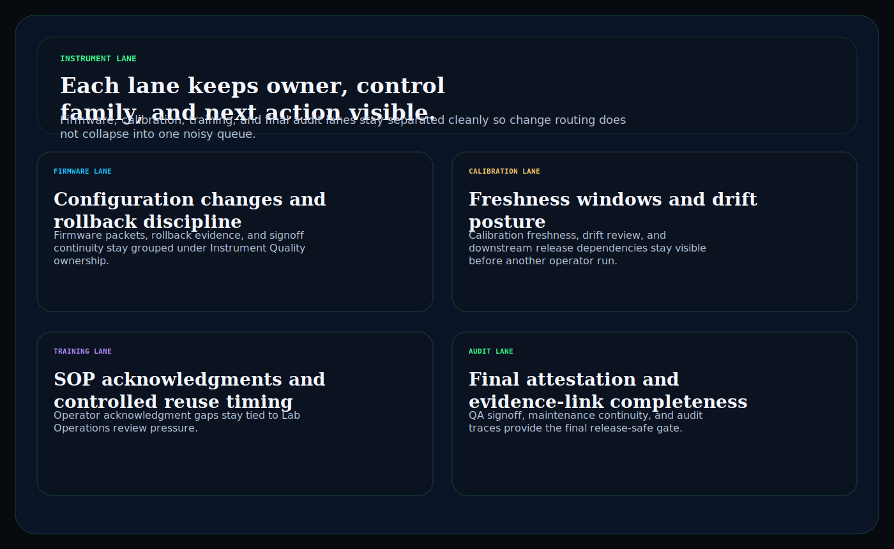
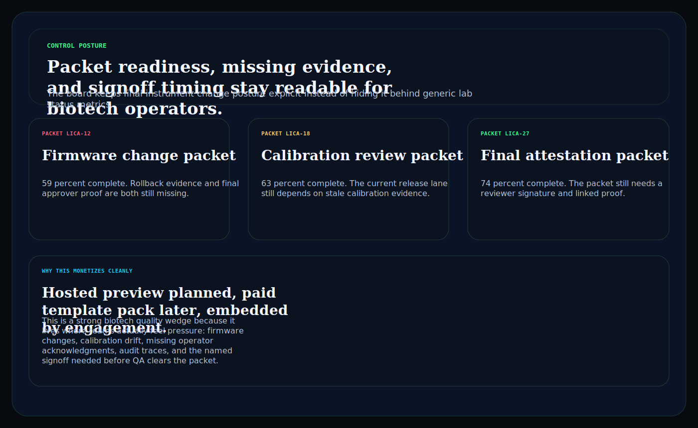

# lab-instrument-change-audit

C# / ASP.NET operator surface for lab instrument change packets, firmware and calibration control gaps, audit-trace repair, and final attestation posture.

## Why this matters

Biotech and diagnostics teams do not need another vague compliance landing page. They need a board that keeps firmware change packets, calibration freshness, SOP acknowledgments, maintenance continuity, audit traces, and final QA attestation visible together before weak instrument packets slip into downstream release review.

This repo is the public proof surface for that pattern:

- `Hosted preview planned` for a browser-based instrument change audit desk
- `Embedded by engagement` for teams that need the routing model inside a regulated lab or diagnostics workflow

## What it includes

- ASP.NET Core minimal API in C#
- synthetic instrument change snapshots, audit gaps, and control packets
- operator surfaces for:
  - `/instrument-lane`
  - `/change-log`
  - `/control-posture`
  - `/verification`
  - `/docs`
- structured JSON endpoints under `/api/*`
- static Pages export with `robots.txt`, `sitemap.xml`, and `CNAME`

## Product depth

This repo models the operating questions a lab, diagnostics, metrology, or quality leader needs answered before an instrument change is allowed to keep moving:

- Which firmware, calibration, SOP, maintenance, audit-trace, or attestation blocker is still unresolved?
- Which function owns the next remediation step?
- Which packet is safe enough for reuse or downstream release review?
- How can the team show credible instrument-governance depth without exposing regulated data or overstating compliance status?

## What these repos have in common

Kinetic Gain proof surfaces use the same product pattern: `risk`, `owner`, `proof`, and `next action`.

- `risk` names the fragile handoff before it turns into another vague escalation
- `owner` keeps the accountable function attached to the packet
- `proof` is inspectable through screenshots, static HTML, sample payloads, and API routes
- `next action` is readable by operators, buyers, and board-facing reviewers

## Operating workflow

1. Model the instrument lane: classify the synthetic change snapshot and identify the affected instrument-control surface.
2. Attach evidence posture: connect firmware review, calibration recency, SOP acknowledgement, maintenance continuity, audit trace, and attestation state.
3. Route the decision: assign the owner, blocker severity, and next safe action before reuse or release review.

## Screenshots





## Verification

- synthetic instrument change and audit evidence only
- no patient, clinician, or proprietary biotech secrets
- no claim of CLIA, GxP, FDA, or clinical compliance
- this is a control-plane proof surface for biotech workflow depth, not a compliance certification claim

## Local run

```powershell
dotnet test
dotnet run --project src/LabInstrumentChangeAudit.Api -- --demo
dotnet run --project src/LabInstrumentChangeAudit.Api
```

Then open:

- `http://127.0.0.1:5094/`
- `http://127.0.0.1:5094/instrument-lane`
- `http://127.0.0.1:5094/change-log`
- `http://127.0.0.1:5094/control-posture`

## Render static site

```powershell
dotnet run --project src/LabInstrumentChangeAudit.Api -- --prerender
```

## Related docs

- [Embedded framing](./docs/KINETIC_GAIN_EMBEDDED.md)
- [Origin story](./docs/ORIGIN.md)
